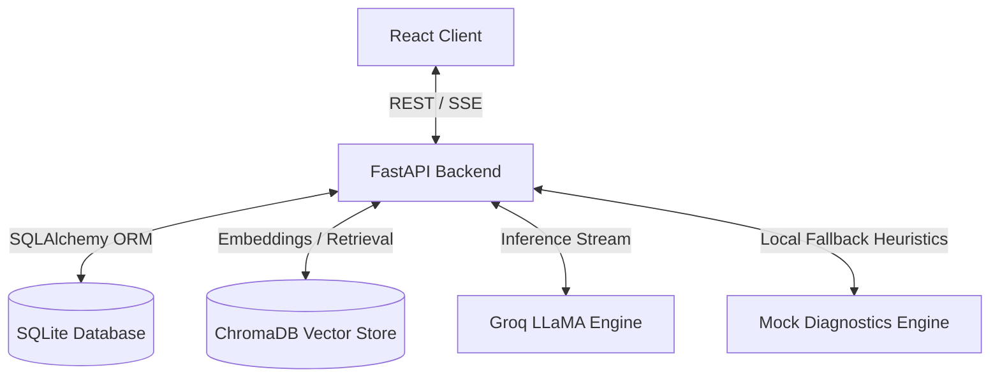
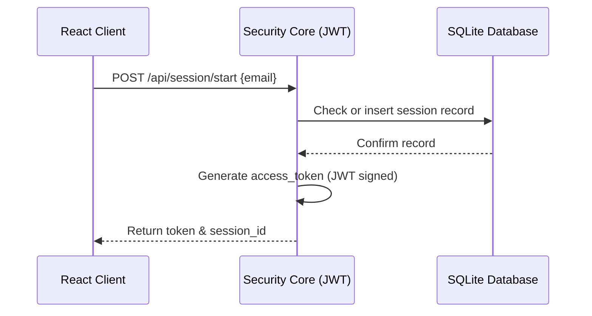
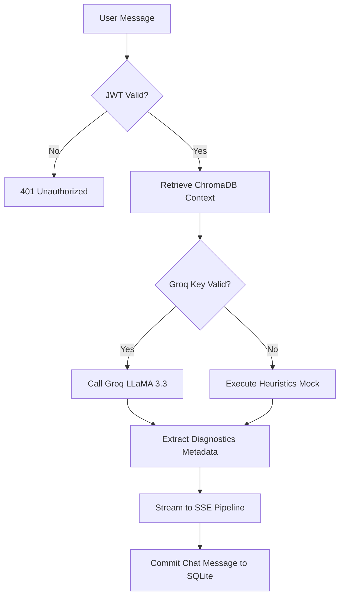
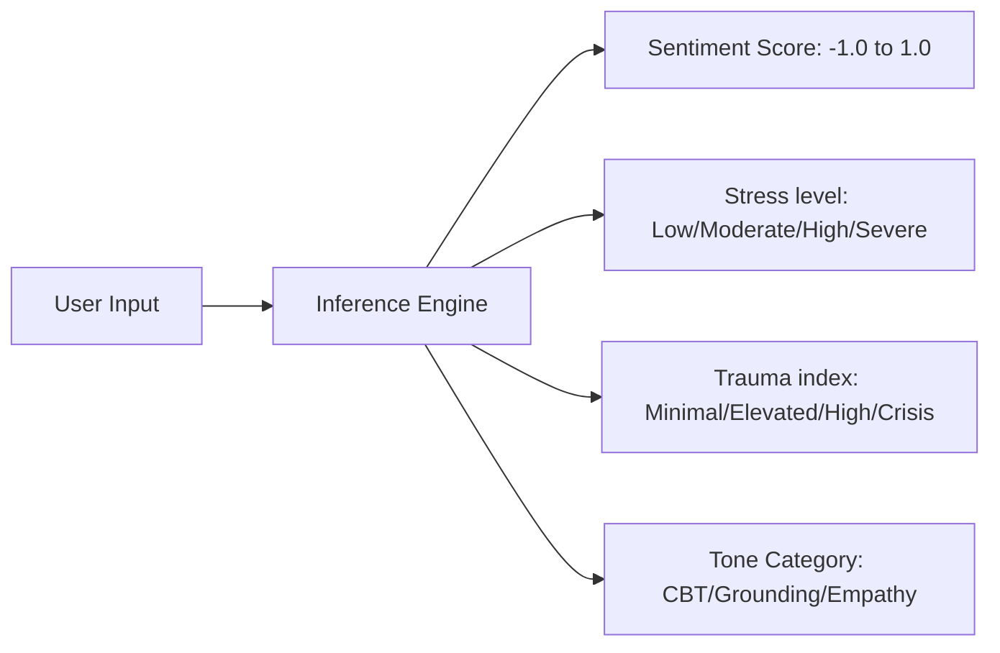
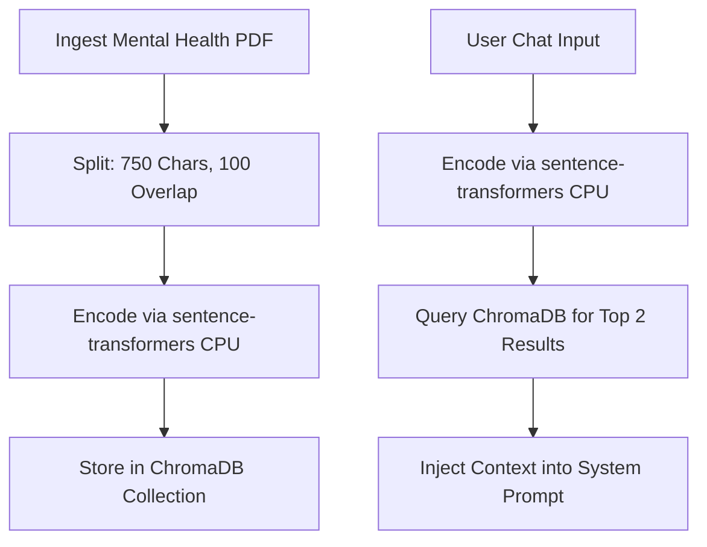
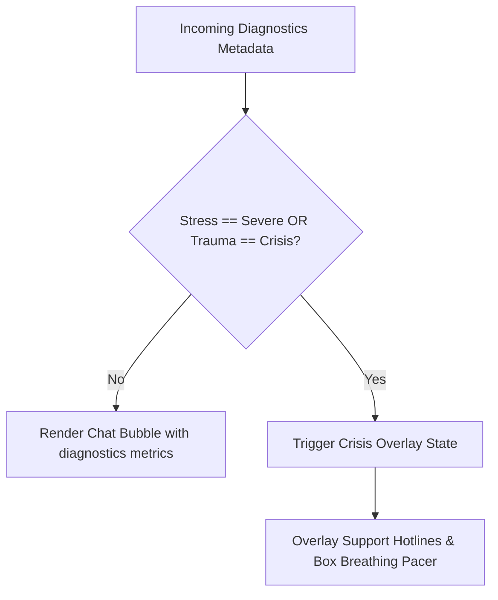
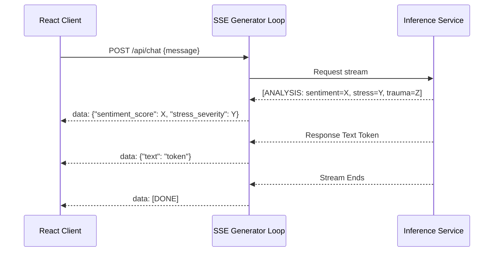
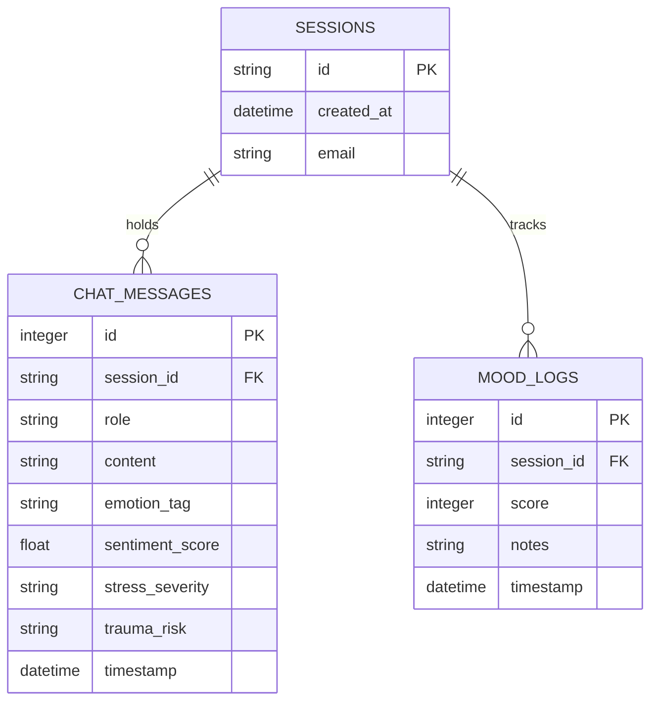
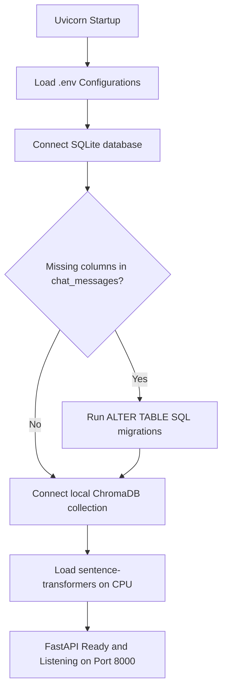
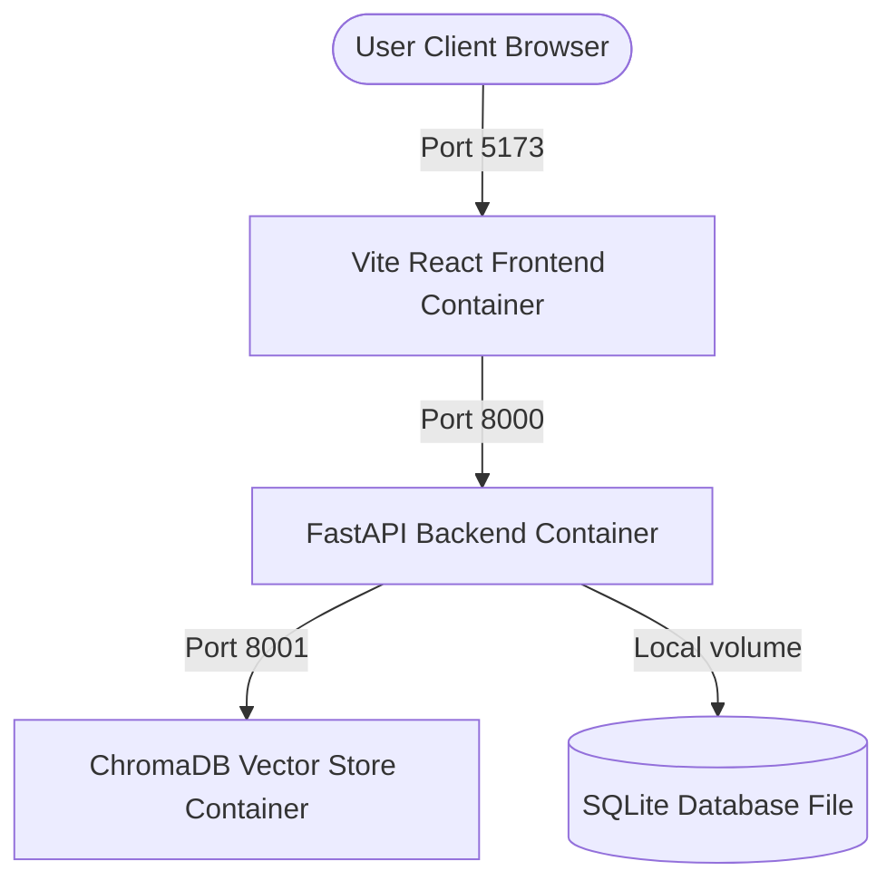

# System Architecture and Component Blueprints

This document provides a detailed overview of the system architecture, component topologies, and data pipelines for the **MindEase** AI Diagnostics Platform.

---

## 1. High-Level Architecture Diagram

The system uses a decoupled client-server architecture. The React frontend interacts with the FastAPI backend through REST APIs and Server-Sent Events (SSE).

---

## 2. Authentication Flow Diagram

Authentication is token-based. Sessions are initiated anonymously or using an email, which is encoded in a JWT returned to the client.

---

## 3. Chat Request Lifecycle Diagram

This diagram displays the lifecycle of a user prompt, showing how context retrieval, diagnostics, and text streaming are orchestrated.

---

## 4. Diagnostics Pipeline Diagram

The diagnostics pipeline extracts emotional indicators from user messages.

---

## 5. RAG Retrieval Flowchart

This diagram outlines the process of chunking, embedding, indexing, and retrieving mental health guidelines.

---

## 6. Crisis Escalation Workflow

When computed metrics exceed safety thresholds, the system overrides standard chat operations.

---

## 7. SSE Streaming Sequence Diagram

Server-Sent Events are utilized to stream response text concurrently with metadata payload chunks.

---

## 8. Database Entity Relationship Diagram

The relational data model tracks active sessions, chat history, and mood logs.

---

## 9. Application Startup Flow

The backend runs startup lifecycle checks before accepting incoming network requests.

---

## 10. Deployment Architecture Diagram

This diagram displays the multi-container configuration orchestrated using Docker Compose.

