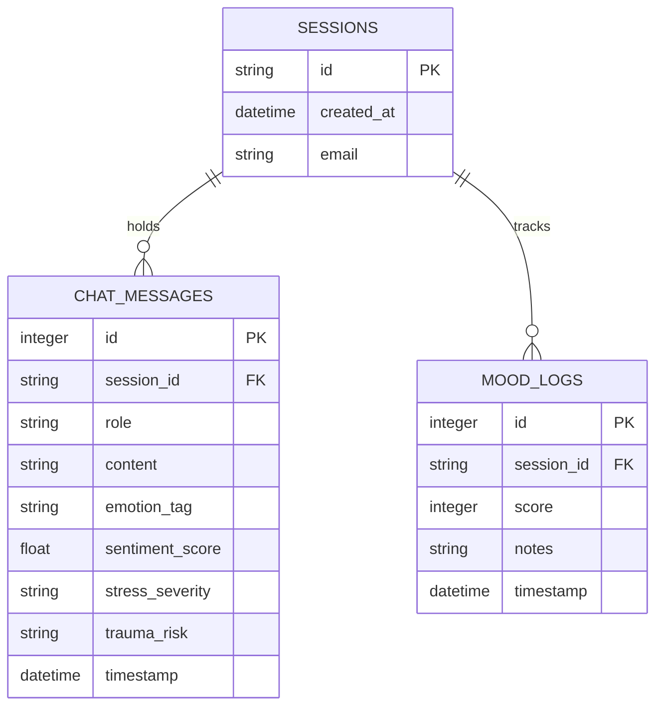

# Database Schema Specification

This document defines the relational database model, field parameters, indexes, and migration strategies implemented in the **MindEase AI Diagnostics Platform**.

---

## 1. Entity Relationship Model

The database uses a clean star-style layout, centering on active user sessions.



---

## 2. Table Specifications

### 2.1 Table: `sessions`
Stores unique identifiers for anonymous or email-bound user work environments.

| Column | Data Type | Constraint | Description |
| :--- | :--- | :--- | :--- |
| `id` | VARCHAR(36) | PRIMARY KEY | Unique UUID string. |
| `created_at` | DATETIME | DEFAULT CURRENT_TIMESTAMP | UTC timestamp of session creation. |
| `email` | VARCHAR(120) | NULLABLE | Optional user email address for syncing records. |

### 2.2 Table: `chat_messages`
Logs chat history transcripts along with analytical diagnostics metrics.

| Column | Data Type | Constraint | Description |
| :--- | :--- | :--- | :--- |
| `id` | INTEGER | PRIMARY KEY AUTOINCREMENT | Unique sequence identifier. |
| `session_id` | VARCHAR(36) | FOREIGN KEY -> `sessions.id` | Reference to the associated session. |
| `role` | VARCHAR(20) | NOT NULL | Role of speaker (`user` or `assistant`). |
| `content` | TEXT | NOT NULL | Dialogue message body text. |
| `emotion_tag` | VARCHAR(50) | NULLABLE | Assigned tone category (`🌿 Grounding`, etc.). |
| `sentiment_score` | FLOAT | NULLABLE | Emotional rating score from `-1.00` to `+1.00`. |
| `stress_severity` | VARCHAR(20) | NULLABLE | Classified stress intensity (`Low`, `Moderate`, `High`, `Severe`). |
| `trauma_risk` | VARCHAR(20) | NULLABLE | Classified trauma threat (`Minimal`, `Elevated`, `High`, `Crisis`). |
| `timestamp` | DATETIME | DEFAULT CURRENT_TIMESTAMP | UTC timestamp of the dialogue. |

### 2.3 Table: `mood_logs`
Logs daily self-reported emotional status ratings.

| Column | Data Type | Constraint | Description |
| :--- | :--- | :--- | :--- |
| `id` | INTEGER | PRIMARY KEY AUTOINCREMENT | Unique sequence identifier. |
| `session_id` | VARCHAR(36) | FOREIGN KEY -> `sessions.id` | Reference to the associated session. |
| `score` | INTEGER | NOT NULL | Check-in rating rating integer from `1` to `10`. |
| `notes` | TEXT | NULLABLE | Optional textual triggers or annotations. |
| `timestamp` | DATETIME | DEFAULT CURRENT_TIMESTAMP | UTC timestamp of the check-in. |

---

## 3. Database Indexes

To maintain search performance as transaction volumes grow, the following indexes are declared:

1. **`idx_messages_session`**: Defined on `chat_messages(session_id)`. Optimizes chat history retrieval.
2. **`idx_messages_timestamp`**: Defined on `chat_messages(timestamp)`. Optimizes sorting operations.
3. **`idx_mood_session_time`**: Composite index defined on `mood_logs(session_id, timestamp)`. Optimizes analytics dashboard generation.

---

## 4. Self-Healing Schema Migrations

To support schema growth without losing existing database records, the initialization script (`backend/database.py`) executes a self-healing check on startup:

1. The script establishes a direct connection and inspects database columns using SQLAlchemy `inspect`.
2. It compiles a list of active columns in the `chat_messages` table.
3. If columns like `sentiment_score`, `stress_severity`, or `trauma_risk` are missing, it dynamically generates and runs `ALTER TABLE` SQL commands:
   ```sql
   ALTER TABLE chat_messages ADD COLUMN sentiment_score FLOAT DEFAULT NULL;
   ALTER TABLE chat_messages ADD COLUMN stress_severity VARCHAR(20) DEFAULT NULL;
   ALTER TABLE chat_messages ADD COLUMN trauma_risk VARCHAR(20) DEFAULT NULL;
   ```
4. This ensures that developer instances automatically update their schemas without losing any data.
