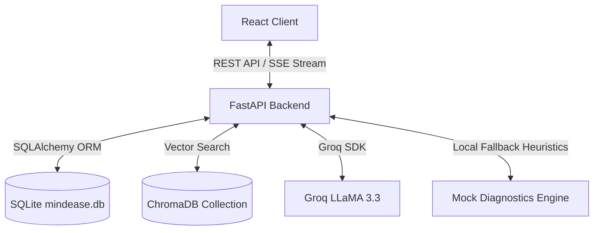
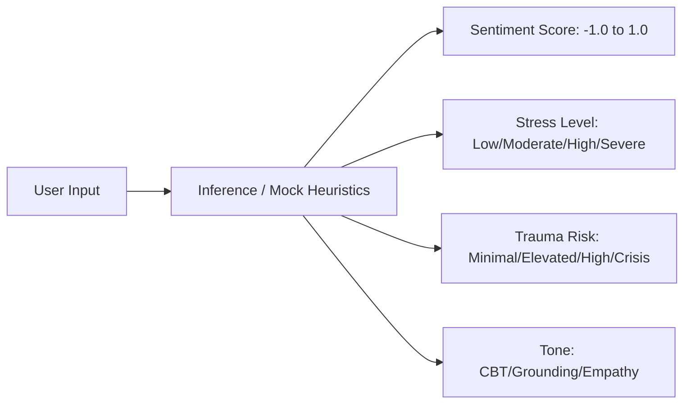
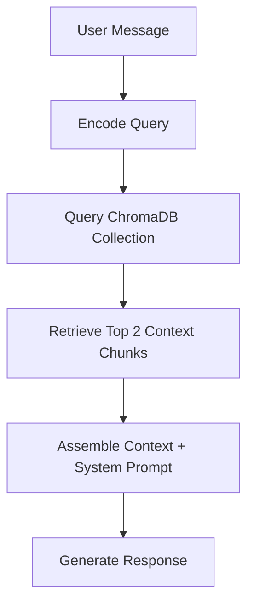
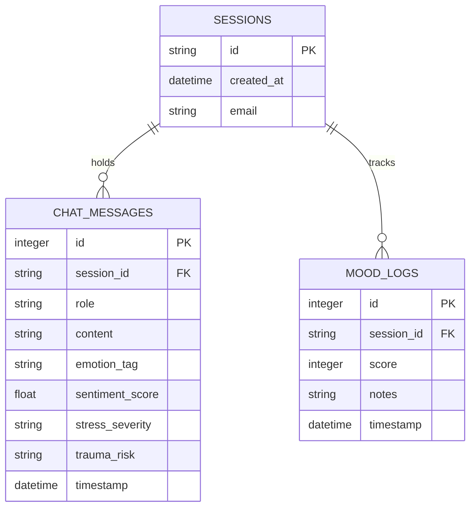
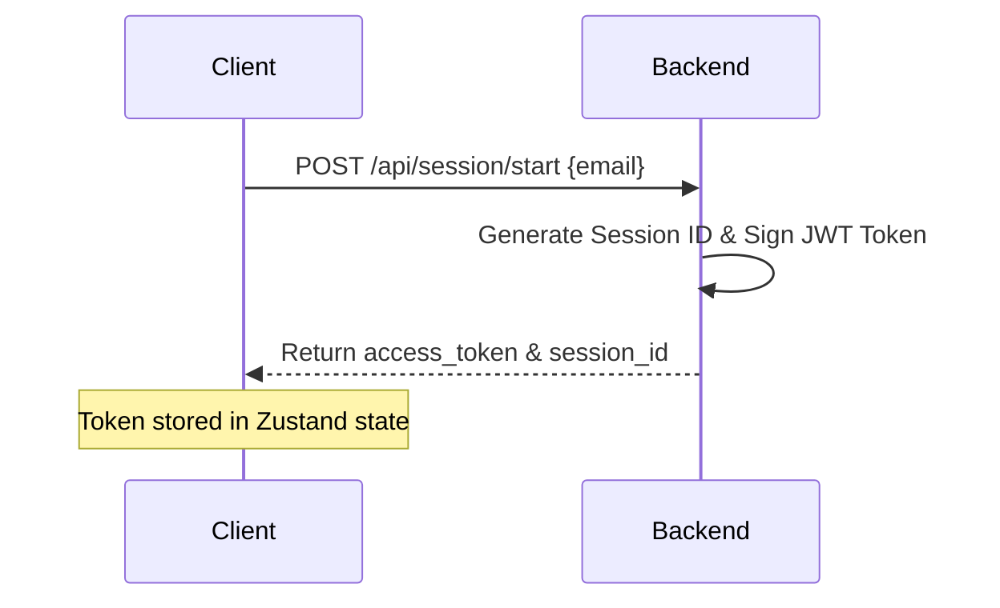
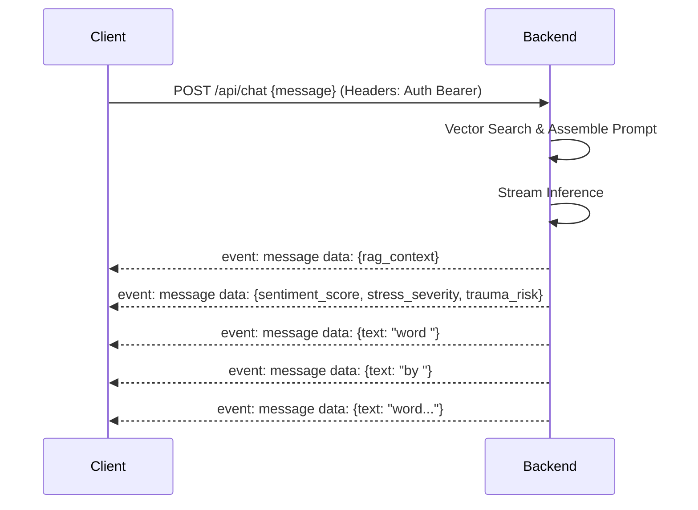

# MindEase: AI Diagnostics and Empathetic Companion Platform

MindEase is a self-contained AI-native mental health companion and diagnostic system. The platform integrates clinical-style diagnostic evaluation with Retrieval-Augmented Generation (RAG) to provide real-time, context-aware guidance.

---

## 1. Project Overview

MindEase provides a secure, anonymous environment for users to log daily mood ratings, participate in guided breathing cycles, and interact with an empathetic companion. The system automatically processes user inputs to track emotional telemetry, classify stress intensity levels, identify crisis risks, and retrieve supporting clinical material from a vector database.

---

## 2. Problem Statement

Empathetic AI interfaces often lack structured metrics to monitor user progression or identify critical distress. Without real-time telemetry, conversational agents cannot adapt their responses dynamically or trigger safety protocols when severe mental health distress is detected. Furthermore, production AI systems are highly dependent on external API availability; a loss of connection to LLM providers can cause complete application failure.

---

## 3. Objectives

- **Develop a Unified Diagnostics Pipeline**: Process user messages to extract sentiment, stress severity, and trauma risk markers.
- **Implement Real-time Event Streaming**: Stream dialogue responses alongside diagnostic metadata using Server-Sent Events (SSE).
- **Establish Local Vector Storage**: Store clinical guidance documents in ChromaDB and perform semantic retrieval to ground agent interactions.
- **Ensure System Resiliency**: Maintain service availability by designing a local fallback engine that takes over if Groq API keys are absent.
- **Build a Responsive Telemetry Dashboard**: Render analytics charts mapping weekly mood scores and stress category distributions.

---

## 4. Features

- **Guided Landing Calibration**: A pre-session breathing cycle to establish user baseline states.
- **Telemetry-equipped Chat bubbles**: Message bubbles displaying computed diagnostics (sentiment score, stress category, trauma index).
- **Automated Crisis Intervention**: An instant interface override that displays support hotlines and a breathing pacer if severe distress is flagged.
- **HUD Insights Dashboard**: Visualizations of user check-in history, mood trends, and stress distributions.
- **Self-Healing Schema Migrations**: Automated database migrations on application startup.

---

## 5. Technology Stack

- **Backend Framework**: FastAPI (Uvicorn ASGI server)
- **Database (Relational)**: SQLite via SQLAlchemy ORM
- **Vector Database**: ChromaDB
- **Embeddings Model**: sentence-transformers (all-MiniLM-L6-v2) on CPU
- **LLM Provider**: Groq API (LLaMA 3.3 70B)
- **Frontend Framework**: React 19 (Vite build tool)
- **State Management**: Zustand
- **Visualization Library**: Recharts
- **Animation Engine**: Framer Motion

---

## 6. System Architecture

The application utilizes a decoupled client-server architecture. All communications between the React client and the FastAPI backend are routed via REST APIs and Server-Sent Events.



---

## 7. Backend Architecture

The backend is built as a modular FastAPI service:
- **`main.py`**: Declares REST endpoints, CORS configurations, rate-limiting rules, and the SSE generator loop.
- **`database.py`**: Initializes the engine, maps SQLAlchemy models, and runs self-healing schema migrations.
- **`llm_client.py`**: Manages credentials verification, structures model instructions, and runs the mock diagnostics generator.
- **`mood_tracker.py`**: Computes session streaks and aggregates weekly metrics.
- **`security.py`**: Generates and decodes JWT tokens.

---

## 8. Frontend Architecture

The frontend is structured as a Single-Page Application (SPA) using React 19:
- **`Landing.jsx`**: Wrapper running session setup and loading the calibration pacer.
- **`Chat.jsx`**: Dialogue window with real-time SSE stream events and interactive sidebar controllers.
- **`Insights.jsx`**: Telemetry metrics console.
- **`useSSEStream.js`**: Hook to parse chunk payloads and update local Zustand store variables.
- **`useMoodStore.js`**: Central state cache syncing session tokens and message history.

---

## 9. AI Diagnostics Pipeline

The diagnostics pipeline evaluates user messages along four dimensions:



These parameters are retrieved during dialogue generation and returned to the client in the first SSE packet.

---

## 10. Retrieval-Augmented Generation Pipeline

To ground responses in evidence-based guidelines:
1. PDFs are placed in the `backend/data/pdfs/` directory.
2. The ingestion script splits the text into chunks of 750 characters with a 100 character overlap.
3. The chunks are converted into 384-dimensional vectors using the `all-MiniLM-L6-v2` encoder and indexed in ChromaDB.
4. During user interactions, ChromaDB is queried for the top 2 matching context blocks.



---

## 11. Database Design

MindEase implements a relational schema mapping sessions, transcripts, and mood inputs.



---

## 12. Authentication Flow

Authentication is session-based. A user initializes a session by providing an optional email, receiving a JWT token in return.



---

## 13. Server-Sent Events Streaming Pipeline

SSE is utilized to stream dialogue responses.



---

## 14. Offline Mock Diagnostics Engine

If the system determines that the `GROQ_API_KEY` is missing or is set to a placeholder, it redirects operations to the local fallback engine. This engine parses inputs for distress keywords (such as "stressed", "anxious", "die") and streams back realistic, empathetic messages alongside structured diagnostics metadata matching the input severity.

---

## 15. Installation Instructions

See [INSTALLATION.md](file:///c:/Users/sarca/OneDrive/Documents/projects/stress-trauma-detection/mental-health-support-chat-bot--main/mental-health-support-chat-bot--main/INSTALLATION.md) for detailed prerequisites and configuration steps.

---

## 16. Local Development Setup

To initialize the application locally from a clean terminal:
```powershell
# 1. Setup virtual environment
python -m venv c:\Users\sarca\OneDrive\Documents\projects\stress-trauma-detection\venv
c:\Users\sarca\OneDrive\Documents\projects\stress-trauma-detection\venv\Scripts\Activate.ps1

# 2. Install dependencies
pip install -r backend/requirements.txt

# 3. Start Backend
cd backend
uvicorn main:app --host 127.0.0.1 --port 8000 --reload

# 4. Start Frontend React Client (Open separate console)
cd frontend
npm install
npm run dev
```

---

## 17. Environment Variables

Create a `.env` file in the `backend/` directory:
- `GROQ_API_KEY`: Groq Cloud access token.
- `JWT_SECRET`: Signature key for encoding session tokens.
- `ADMIN_TOKEN`: Authentication key for uploading PDFs.
- `CHROMA_HOST`: Host name of ChromaDB instance (default: `localhost`).
- `CHROMA_PORT`: Port number of ChromaDB instance (default: `8001`).

---

## 18. API Documentation Links

- **Swagger UI**: [http://localhost:8000/docs](http://localhost:8000/docs)
- **ReDoc**: [http://localhost:8000/redoc](http://localhost:8000/redoc)

---

## 19. Folder Structure

```text
.
├── backend/                  # FastAPI Application
│   ├── data/                 # Relational database and vector store persistence
│   │   ├── pdfs/             # Grounding source documents (.pdf)
│   │   └── mindease.db       # SQLite Database File
│   ├── main.py               # API declarations and SSE routing
│   ├── database.py           # Table declarations and migrations
│   ├── llm_client.py         # LLM streams and Mock Engine
│   └── requirements.txt      # Python dependencies
├── frontend/                 # React Client SPA
│   ├── src/
│   │   ├── components/       # Interface widgets (BreathingGate, SoundController)
│   │   ├── hooks/            # Zustand state hooks and SSE streamers
│   │   └── pages/            # Core views: Landing, Chat, Insights
│   └── package.json          # Node dependencies
├── docs/                     # Project Documentation
│   └── screenshots/          # Application screenshots
└── docker-compose.yml        # Multi-container orchestration configurations
```

---

## 20. Deployment Instructions

Containerized deployment is configured using the root `docker-compose.yml`. For instructions on deploying to container runtimes (such as GCP Cloud Run or AWS ECS), see [DEPLOYMENT.md](file:///c:/Users/sarca/OneDrive/Documents/projects/stress-trauma-detection/mental-health-support-chat-bot--main/mental-health-support-chat-bot--main/DEPLOYMENT.md).

---

## 21. Performance Considerations

- **Sentence-Transformers CPU Inferences**: Calculating vectors locally on CPU takes ~100-200ms per query. If request volumes scale, deploy the embedder on GPU or transition to serverless providers.
- **SQL Indexing**: Add indexes on the `chat_messages` table for `session_id` and `timestamp` fields if history collections exceed 100,000 records.

---

## 22. Security Considerations

- **CORS Configuration**: Wildcard origins are permitted in development. Restrict `allow_origins` to your production frontend domain in deployment configurations.
- **JWT Key**: Ensure the default `JWT_SECRET` key is overridden using high-entropy production keys.

---

## 23. Future Improvements

- **Database Transition**: Transition SQLite to PostgreSQL or Supabase for production database scaling.
- **User Authentication**: Implement user registration routes and securely hash passwords using bcrypt.
- **Pinecone Vector Integration**: Migrate local ChromaDB storage to Pinecone or Qdrant serverless collections.

---

## 24. License Information

MindEase is open-source software licensed under the MIT License. See [LICENSE](file:///c:/Users/sarca/OneDrive/Documents/projects/stress-trauma-detection/mental-health-support-chat-bot--main/mental-health-support-chat-bot--main/LICENSE) for details.
